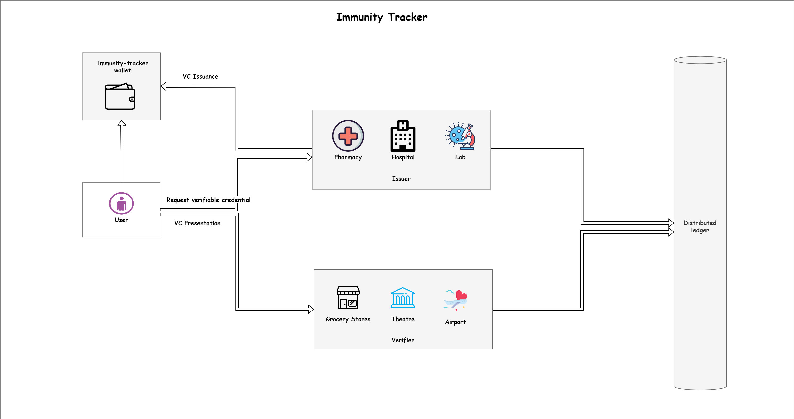



<h1 align="center"><a href="https://iamdivakarkumar.com/" target="blank"> Immunity Tracker</a></h1>

  <b>Decentralized identifier for health information in a secure and reliable way</b>

  <a href="#features">Features</a> | <a href="#sample">Sample</a> | <a href="#installation">Installation</a> | <a href="#usage">Usage</a> | <a href="#special-thanks">Special Thanks</a> | <a href="https://github.com/cloud-jas/AzureFunctions.Extensions.Middleware/discussions">Forum</a>

 

  
Table of Contents

  <ol>
    <li>
      <a href="#features">Features</a>                  
    </li>
    <li><a href="#Supported-Frameworks">Architecture</a></li>
    <li>
      <a href="#installation">Getting Started</a>      
    </li>
    <li><a href="#usage">Usage</a></li>
    <li><a href="#roadmap">Roadmap</a></li>
    <li><a href="#contact">Contact</a></li>
  </ol>

## Features

 * Able to add multiple custom middlewares to the pipeline
 * Licenced under MIT - 100% free for personal and commercial use

## Architecture

<h1 align="center"><a href="https://iamdivakarkumar.com/" target="blank"> Immunity Tracker</a></h1>

 
(<a href="#top">back to top</a>)

## Run

`dotnet run`

## Usage

### Getting Started

(<a href="#top">back to top</a>)

## Contact

[![Nuget library screenshot][product-screenshot]](https://iamdivakarkumar.com)

Divakar Kumar - [@Divakar-Kumar](https://www.linkedin.com/in/divakar-kumar/) - https://iamdivakarkumar.com

Project Link: [https://github.com/Divakar-kumar/Immunity-Tracker](https://github.com/Divakar-Kumar/Immunity-Tracker)

(<a href="#top">back to top</a>)

[product-screenshot]: https://challengepost-s3-challengepost.netdna-ssl.com/photos/production/software_photos/001/809/514/datas/gallery.jpg